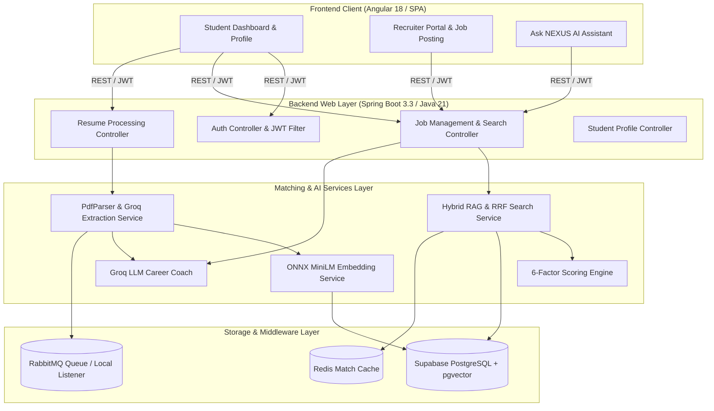
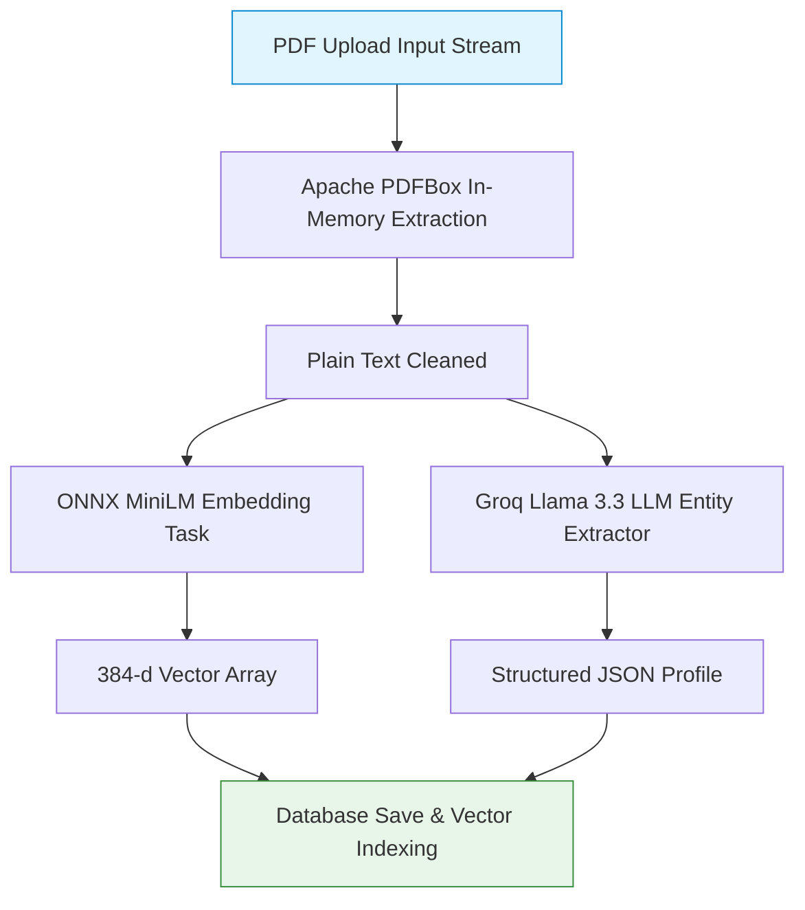
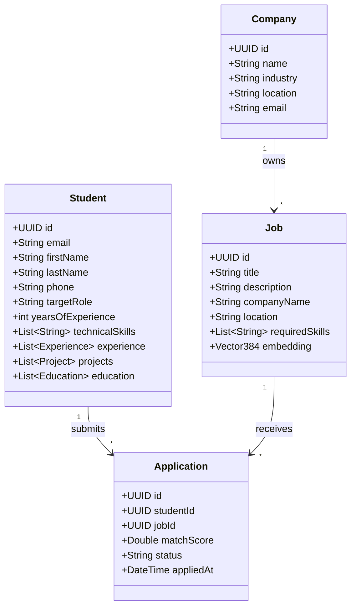

# 🚀 NEXUS – AI-Powered Smart Job Matching Platform

[](https://github.com/Ruturaj24062006/Smart-Job-Matching-Dashboard/blob/main/LICENSE)
[](https://openjdk.org/projects/jdk/21/)
[](https://spring.io/projects/spring-boot)
[](https://angular.dev/)
[](https://render.com/)

An enterprise-grade, AI-driven recruitment platform designed to seamlessly connect job seekers with employers through **Hybrid RAG Semantic Search (pgvector + BM25 RRF)**, **Deterministic 6-Factor Scoring**, **Fast In-Memory PDF Resume Parsing**, and an **Interactive AI Career Assistant**.

---

## 👥 Team Details & Project Metadata
- **Team Name**: the solver squad
- **Team Members**:
  - **Ruturaj Ambure** (Lead Architecture & Backend Engineer)
  - **Shantanu Gudmewar** (Frontend Lead & UI/UX Developer)
  - **Atharv Bhavsar** (AI/ML & DevOps Engineer)

---

## 🌐 Live Application & Demo Video
- **Project Demo Video**: [Google Drive Folder](https://drive.google.com/drive/folders/1fae56KZ36IzFFKrRKQhli21psqtY6LKp?usp=sharing)
- **Frontend Web App**: [https://nexus-frontend-gmd1.onrender.com](https://nexus-frontend-gmd1.onrender.com)
- **Backend REST API**: [https://nexus-backend-56gy.onrender.com](https://nexus-backend-56gy.onrender.com)
- **GitHub Repository**: [https://github.com/Ruturaj24062006/Smart-Job-Matching-Dashboard](https://github.com/Ruturaj24062006/Smart-Job-Matching-Dashboard)

---

## 🔑 Pre-Seeded Accounts & Test Credentials

You can log in directly using the pre-seeded recruiter/company accounts or register a new student account:
Create  new acccount directly

---

## ✨ Key Features

| Student Module | Recruiter Module | AI Features |
|----------------|------------------|-------------|
| 🔐 Authentication & Session Persistence | 🔐 Recruiter Auth & Management | 🤖 In-Memory Resume Parsing |
| 📊 Dashboard with Live Match Scores | 📊 Applicant Analytics Dashboard | 📐 384-d Vector Embeddings (`all-MiniLM-L6-v2`) |
| 📁 Fast PDF Resume Upload & Parsing | 🛠️ Job Posting & Requirements Engine | 🔍 Hybrid RAG Search (`pgvector` + BM25) |
| 🧩 9-Section Structured Profile Editor | 👥 AI-Ranked Candidate Lists | 🎯 Deterministic 6-Factor Match Scoring |
| 🤖 Ask NEXUS AI Career Assistant | 📄 Candidate Resume & Profile Viewer | 📈 Real-Time Job Recommendations |
| 🔎 Search & Filter Jobs (Role, City, Skills) | 📈 Recruitment Pipeline Insights | 🛡️ Automatic Profile Fallback Resilience |
| 💾 Saved Jobs & Application Tracker | 🏢 Company Profile Management | 🗣️ Groq LLM Interactive Coaching (`Llama 3.3 70B`) |

---

## 🏗️ System Architecture



---

## 🛠️ Complete Technology Stack

| Component | Technology | Description |
|-----------|------------|-------------|
| **Frontend Framework** | **Angular 18** | Modern Standalone Components, Signals API, RxJS, Template-driven & Reactive Forms |
| **Frontend Styling** | **Vanilla CSS3** | Glassmorphism UI, custom CSS variables, responsive CSS Grid/Flexbox, micro-animations |
| **Backend Framework** | **Java 21 / Spring Boot 3.3+** | Stateless REST APIs, Spring Data JPA, Spring Security 6, Jackson JSON |
| **Authentication** | **Supabase Auth & JWT** | Bearer JWT Token Interceptors, BCrypt Password Encoding, Role-Based Route Guards |
| **Database** | **Supabase PostgreSQL 16+** | `pgvector` extension for 384-d cosine similarity search, `tsvector` for BM25 FTS |
| **Caching & Queues** | **Redis & RabbitMQ** | 1-hour TTL query result caching, asynchronous resume processing queues with local event fallback |
| **Embeddings & NLP** | **ONNX `all-MiniLM-L6-v2`** | Native in-process Java 384-dimensional vector generation |
| **LLM Service** | **Groq API (`Llama 3.3 70B`)** | Ultra-fast JSON resume extraction and interactive candidate career coaching |
| **Document Processing** | **Apache PDFBox & Apache Tika** | Direct stream PDF parsing avoiding disk I/O bottlenecks |
| **DevOps & Cloud** | **Render Platform** | Dockerized Spring Boot Web Services & Angular Static Site deployment |

---

## 📋 Project Workflows

### 🎓 Student User Flow
1. **Registration & Auth**: Sign up at `/register` or log in with credentials.
2. **Resume Ingestion**: Upload PDF resume; system parses text in memory, extracts structured entities via Groq LLM, and generates dense vector embeddings.
3. **Profile Management**: Manage 9 structured sections (Personal, Professional, Skills, Education, Experience, Projects, Certifications, Resume, Account Settings).
4. **Job Search & Matching**: View live matches sorted by score donut ring. Filter by skill chips, city, work mode, or job boards.
5. **Ask NEXUS AI**: Click **Ask AI** on any job card for tailored AI coaching and fit explanation.
6. **Apply & Track**: One-click application submission with instant recruiter notification.

### 🧑‍💼 Recruiter User Flow
1. **Login & Portal Access**: Log in as recruiter (`hr@nexoratech.example`).
2. **Company & Job Creation**: Post job openings specifying required skills, experience level, location, and salary bounds.
3. **Candidate Discovery & Ranking**: System runs Hybrid RAG and ranks applicant profiles using the 6-factor scoring engine.
4. **Application Review**: Inspect candidate profile strength, extracted skills, and submission dates.

---

## 📄 Resume Processing Pipeline



* **Fallback Strategy**: If PDF parsing fails (e.g. scanned image PDF or timeout), system automatically synthesizes keywords and vector embeddings from the **Student's Profile details**, ensuring 100% workflow uptime.

---

## 🤖 AI Job Matching Pipeline

Matching relies on a **Hybrid RAG** architecture combining vector search, full-text search, and deterministic scoring:

```
Score = (Skills × 0.40) + (Projects × 0.20) + (Experience × 0.15) + (Domain × 0.10) + (SoftSkills × 0.10) + (Education × 0.05)
```

1. **Dense Vector Search**: `pgvector` calculates cosine distance similarity (`<=>`) against job embeddings.
2. **Sparse Search (BM25)**: PostgreSQL `tsvector` calculates keyword relevance via `websearch_to_tsquery`.
3. **Reciprocal Rank Fusion (RRF)**: Merges dense and sparse ranks in SQL using:
   $$RRF(d) = \sum \frac{1}{60 + r_i(d)}$$
4. **Deterministic 6-Factor Engine**: Applies domain-specific weighting to return a final 0–100% match score.

---

## 📂 Repository & Folder Structure

```
Smart-Job-Matching-Dashboard/
├── backend/
│   ├── src/main/java/com/careermatch/backend/
│   │   ├── ai/          # EmbeddingService (ONNX) & GroqService (LLM)
│   │   ├── admin/       # Admin controllers & services
│   │   ├── auth/        # JWT Security, Supabase integration & Auth controllers
│   │   ├── company/     # Company entity & repository
│   │   ├── config/      # AppConfig, SecurityConfig, ThreadPool & Redis config
│   │   ├── job/         # Job entities, repositories, controllers & JobDataSeeder
│   │   ├── matching/    # SearchService (RRF RAG), ScoringService & MatchingService
│   │   ├── recruiter/   # Recruiter management & applicant ranking
│   │   ├── resume/      # PdfParserService, ResumeService, Queue listeners
│   │   └── student/     # Student profile entities, controllers & services
│   ├── pom.xml          # Dependencies (Spring Boot, pgvector, httpclient5, ONNX)
│   └── mvnw.cmd         # Maven wrapper script
├── frontend/
│   ├── src/app/
│   │   ├── core/        # Auth guards, services (student profile, matches, applications)
│   │   ├── features/
│   │   │   ├── auth/            # Login, Register, Password flows
│   │   │   ├── student/
│   │   │   │   ├── dashboard/   # StudentDashboard component & html
│   │   │   │   ├── find-jobs/   # FindJobs component & search interface
│   │   │   │   ├── profile-review/ # Multi-section Profile page
│   │   │   │   └── onboarding/  # Quick onboarding & setup
│   │   │   └── recruiter/       # Recruiter dashboard, Create job, Ranking
│   │   └── shared/      # Navbar, Footer, UI components
│   ├── angular.json     # Angular CLI configuration & production build budgets
│   └── package.json     # Frontend dependencies
└── README.md
```

---

## ⚡ Installation & Setup

### Prerequisites
- **Java JDK 21** or higher
- **Node.js 18+** & **npm**
- **PostgreSQL 16+** with `pgvector` extension enabled (`CREATE EXTENSION IF NOT EXISTS vector;`)
- **Redis Server** (optional, dev fallback available)

### 1. Backend Setup (`/backend`)
```bash
cd backend

# Configure environment variables (or update application.yml)
export DB_HOST=localhost
export DB_PORT=5432
export DB_NAME=careermatch
export DB_USER=postgres
export DB_PASSWORD=your_password
export GROQ_API_KEY=your_groq_api_key

# Build and run Spring Boot server
./mvnw.cmd spring-boot:run
```
Backend API will start at: `http://localhost:8080`

### 2. Frontend Setup (`/frontend`)
```bash
cd frontend

# Install Node dependencies
npm install

# Start Angular development server
npm start
```
Frontend App will start at: `http://localhost:4200`

---

## ▶️ Running the Project

| Component | Dev Command | Port |
|-----------|-------------|------|
| **Backend REST API** | `./mvnw.cmd spring-boot:run` | `8080` |
| **Frontend Web App** | `npm start` | `4200` |
| **Production Build Test** | `npm run build` | `dist/frontend` |

---

## 📚 API Overview

| Endpoint | Method | Role | Description |
|----------|--------|------|-------------|
| `/api/v1/auth/login` | `POST` | Public | Authenticate user & return JWT token |
| `/api/v1/auth/register` | `POST` | Public | Register new Student or Recruiter account |
| `/api/v1/resumes/upload` | `POST` | Student | Upload PDF resume for parsing & embedding |
| `/api/v1/students/profile` | `GET/PUT` | Student | Fetch or update 9-section student profile |
| `/api/v1/jobs/matches` | `GET` | Student | Fetch AI-matched job recommendations |
| `/api/v1/jobs/search` | `GET` | Student | Search jobs using Hybrid RAG (pgvector + BM25) |
| `/api/v1/ai/ask` | `POST` | Student | Send query to Ask NEXUS AI Career Coach |
| `/api/v1/recruiter/jobs` | `POST/GET` | Recruiter | Post new job or view created jobs |
| `/api/v1/recruiter/applications` | `GET` | Recruiter | View ranked applicants for job openings |

---

## 🗂️ Database Schema Overview



---

## 📸 Screenshots & Demonstrations

> *Video Walkthrough and Screenshots are stored in the project assets and Google Drive repository.*

| Student Dashboard | Profile Editor | Ask AI Assistant |
|---|---|---|
| Match Scores & Donut Rings | 9-Section Structured Editor | Instant Career Coaching |

---

## 🚀 Future Enhancements
- 🎙️ **AI Mock Interview Simulator**: Speech-to-text interactive mock technical interviews.
- 📬 **Real-time Push Notifications**: Instant alerts when a high-matching job is posted.
- 📊 **Recruiter Market Analytics**: Salary benchmarking and skill availability maps.
- 📱 **Mobile Native Companion App**: Flutter cross-platform mobile experience.

---

## 🔐 Security & Performance Features
- 🔒 **Stateless JWT Tokens**: Signed authorization headers with strict expiry timers.
- 🛡️ **Role-Based Access Control (RBAC)**: Enforced via Spring Security & Angular Route Guards.
- ⚡ **Sub-Second Search Latency**: In-memory PDFBox parsing + ONNX native embeddings + Redis query caching.
- 🌐 **CORS Configuration**: Restricted origin policies protecting backend API endpoints.

---

## 👥 Contributors

- **Ruturaj Ambure** — Lead Architect & Backend Engineer ([GitHub](https://github.com/Ruturaj24062006))
- **Shantanu Gudmewar** — Frontend Lead & UI/UX Developer
- **Atharv Bhavsar** — AI/ML & DevOps Specialist

---

## 📄 License
This project is licensed under the **MIT License** — see the [LICENSE](LICENSE) file for details.

---

## 📞 Contact Information
For questions, feedback, or enterprise inquiries, reach out via:
- **Email**: `hr@nexoratech.example`
- **GitHub**: [Smart-Job-Matching-Dashboard](https://github.com/Ruturaj24062006/Smart-Job-Matching-Dashboard)
